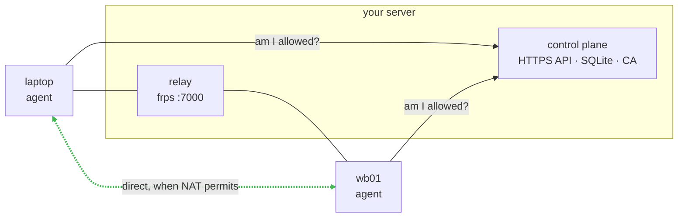

# frp-jump

`ssh wb01` from your laptop to a machine behind NAT. No port forwarding, no VPN,
no public IP on the far side.

frp-jump connects your Linux machines to each other through one small server you
run yourself. Every machine runs an agent. The server decides who may talk to
whom. A connection goes peer-to-peer when the two networks allow it, and falls
back to relaying through your server when they don't — you never have to know
which one happened.

The tunneling itself is [frp](https://github.com/fatedier/frp). frp-jump adds
what frp deliberately leaves to you: identity, authorization, certificates, and
keeping `~/.ssh/config` in sync.



The dotted line is what you get whenever the two networks can be made to talk
directly. The solid path through the relay is the fallback for when they can't.

## What you get

- **Your normal ssh client.** `connect` writes an `~/.ssh/config` entry, so
  `ssh wb01` works — along with `scp`, `rsync`, `ssh -J`, and your editor's
  remote mode.
- **No accounts and no web UI.** A person is an SSH public key. Administration
  is `frp-jump-server` commands run over SSH to your box.
- **One admin action per person, ever.** After their first device is enrolled,
  they add devices and wire up connections themselves.
- **Nothing unenrolled gets in.** Your server runs a private CA and issues a
  client certificate to each device, so a machine that isn't enrolled can't
  reach the relay at all. Tunneled payloads are encrypted, not just the control
  channel.
- **Small.** Python and SQLite on the server, one agent process per device, and
  the upstream frp binaries fetched on first run.

## Quick start

**1. On your server** — a box with a public IP or a domain:

```sh
sudo frp-jump-server install-service \
  --relay-public-addr tunnel.example.com \
  --tls-cert /etc/letsencrypt/live/tunnel.example.com/fullchain.pem \
  --tls-key  /etc/letsencrypt/live/tunnel.example.com/privkey.pem

frp-jump-server users add-key ~/.ssh/id_ed25519.pub --label me
```

The first command creates a system account, a CA, a database, and a systemd
unit. The second registers you. That is the whole server-side setup.

**2. On your laptop** — enroll with the key you just registered, then start the
agent as a service:

```sh
frp-jump-client enroll https://tunnel.example.com ~/.ssh/id_ed25519 --name laptop
sudo frp-jump-client install-service
```

Enrolling without `sudo` matters here: the agent then runs as you, and can
maintain your real `~/.ssh/config`.

**3. On the far machine** — mint a token from the laptop, and run the command it
prints:

```sh
frp-jump-client devices add-token --name wb01
# then, on wb01:
sudo frp-jump-client enroll https://tunnel.example.com <token>
```

**4. Connect:**

```sh
frp-jump-client connect wb01:22
ssh wb01
```

Not installed yet? See [Installation](docs/install.md). Want the same thing with
every step explained, including what to check when a step doesn't work? See
[Getting started](docs/getting-started.md).

## Documentation

| Page | Read it when |
| --- | --- |
| [Installation](docs/install.md) | Picking between apt, pip, and a plain `.deb` |
| [Getting started](docs/getting-started.md) | Setting this up for the first time |
| [CLI reference](docs/cli.md) | Looking up a command or a flag |
| [Configuration](docs/configuration.md) | Changing ports, paths, timeouts; opening a firewall |
| [How it works](docs/how-it-works.md) | Wondering what the agent is actually doing |
| [Security model](docs/security.md) | Deciding whether to trust this with your network |
| [Troubleshooting](docs/troubleshooting.md) | Something is broken |
| [Internals](docs/architecture.md) | Changing the code |

Every command also carries its own `--help` with runnable examples:

```sh
frp-jump-client connect --help
```

## Requirements

- Linux on every machine, including the server.
- Python 3.12+ if you install via pip. The `.deb` bundles its own runtime.
- A public IP or domain for the server, and one open TCP port (7000 by default)
  plus however you serve HTTPS.
- Devices need outbound TCP to the server. Outbound UDP too, if you want
  peer-to-peer rather than relaying.

## Development

```sh
uv sync
uv run pytest tests/unit -q    # fast, no network
uv run ruff check .
```

See [CONTRIBUTING.md](CONTRIBUTING.md). Changes are tracked in
[CHANGELOG.md](CHANGELOG.md).

## License

[MIT](LICENSE)
