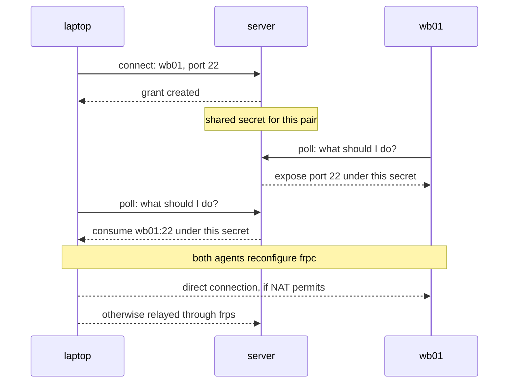

# Getting started

By the end of this page you will have a server, two machines enrolled against
it, and `ssh wb01` working from your laptop even though `wb01` sits behind NAT
with no public address.

It takes about fifteen minutes. Every step ends with a way to check it worked.

## Before you start

You need three machines, or at least two plus something with a public address:

| Role | Needs | In this guide |
| --- | --- | --- |
| Server | A public IP or domain, root access | `tunnel.example.com` |
| Your laptop | Root access, an SSH keypair | `laptop` |
| The far machine | Root access | `wb01` |

You also need an SSH keypair on your laptop. If you don't have one:

```sh
ssh-keygen -t ed25519
```

That key is your identity in frp-jump. There is no password anywhere in this
system.

Install the software on all three machines first — see
[Installation](install.md).

## Part 1 — the server

### Start it

```sh
sudo frp-jump-server install-service \
  --relay-public-addr tunnel.example.com \
  --tls-cert /etc/letsencrypt/live/tunnel.example.com/fullchain.pem \
  --tls-key  /etc/letsencrypt/live/tunnel.example.com/privkey.pem
```

One command, and it does five things:

1. Creates an unprivileged system account called `frp-jump`.
2. Generates a private certificate authority under `/var/lib/frp-jump`.
3. Creates the SQLite database next to it.
4. Writes `/etc/frp-jump/frp-jump.env` with your settings.
5. Installs and starts a hardened systemd unit.

It also drops a wrapper at `/usr/local/bin/frp-jump-server`. The data directory
is `0700`, so admin commands have to run as that account. The wrapper does the
`sudo -u` for you. Anyone who can `sudo` on this box can just type
`frp-jump-server users list`.

**No TLS certificate handy?** Leave `--tls-cert`/`--tls-key` out. The API then
binds `127.0.0.1` only, and you put nginx or Caddy in front of it. What the
server will not do is serve the control plane in cleartext on a public address —
it carries certificates and bearer tokens on every call.

Check it:

```sh
systemctl status frp-jump-server
```

### Register yourself

```sh
frp-jump-server users add-key ~/.ssh/id_ed25519.pub --label me
```

If your key lives on your laptop, not on the server, copy the `.pub` file over
first. It is public, so copy it however is convenient.

Check it:

```sh
frp-jump-server users list
```

This is the only administrative action this setup will ever need from you.
Everything from here on is self-service.

### Open the firewall

Inbound TCP on `7000` (the relay) and on whatever port serves your HTTPS —
`8443` if you passed `--tls-cert`, or `443` if you put a reverse proxy in front.

Full details in [Configuration](configuration.md#ports-and-firewalls).

## Part 2 — your laptop

### Enroll

```sh
frp-jump-client enroll https://tunnel.example.com ~/.ssh/id_ed25519 --name laptop
```

Note the missing `sudo`. Pointing at your **private** key is deliberate: the
agent signs a challenge from the server with it to prove that you are you. The
key itself never leaves the machine.

You should see:

```
Enrolled as laptop (Xk3nP2vQ...)
Next: sudo /path/to/frp-jump-client install-service ...
```

### Start the agent

```sh
sudo frp-jump-client install-service
```

Because state already exists in your home directory, the unit is created with
`User=<you>`. That is what you want on a laptop: the agent maintains your real
`~/.ssh/config`, so `ssh wb01` works from your own shell.

> On a machine that only *exposes* ports and never needs `ssh <name>` to work,
> run `enroll` under `sudo` instead. The agent then gets its own isolated
> `frp-jump-client` system account, which is a little tighter. See
> [Configuration](configuration.md#which-account-should-the-agent-run-as).

### Check it

```sh
frp-jump-client doctor
```

```
✓ enrolled as laptop
✓ frpc present at /home/you/.local/share/frp-jump/bin/frpc
✓ server reachable, heartbeat accepted
✓ protocol compatible (v1, server 0.3.14)
```

The `frpc` line is missing until the agent has run once: it downloads the frp
binaries on first start. Give it a few seconds and try again.

## Part 3 — the far machine

`wb01` has no copy of your private key, and should not get one. Mint a one-time
token from the laptop instead:

```sh
frp-jump-client devices add-token --name wb01
```

```
Run this on the new device to enroll it (shown once):
frp-jump-client enroll https://tunnel.example.com 4f9c2e...
```

The token is shown once and is good for 24 hours. Run the printed command on
`wb01`, under `sudo`:

```sh
sudo frp-jump-client enroll https://tunnel.example.com 4f9c2e...
```

Running as root here lets `enroll` install and start the service immediately, so
there is nothing else to do on that machine.

Check it, from your laptop:

```sh
frp-jump-client devices list
```

```
      Your devices
Name    Status   Online   Last seen
laptop  enabled  online   2026-09-26T21:04:11+00:00
wb01    enabled  online   2026-09-26T21:04:12+00:00
```

Both devices report to the same account, because the token was minted by one of
your own devices.

## Part 4 — connect

```sh
frp-jump-client connect wb01:22
```

```
Connected to wb01:22 as wb01 -- 127.0.0.1:40000 (ssh wb01)
```

Port 22 is recognised as SSH, so the agent writes an `~/.ssh/config` entry for
it. Now:

```sh
ssh wb01
```

That is it. `scp`, `rsync`, `ssh -J`, and your editor's remote mode all work the
same way, because it is your normal ssh client talking to a local port.

### What just happened



`wb01` learns about the new connection on its next poll, which by default is
within two seconds.

### See the state

```sh
frp-jump-client status
```

```
Device: laptop (Xk3nP2vQ...)
Server: https://tunnel.example.com   Relay: tunnel.example.com:7000

Exposed -- other devices can reach these ports on you
Port  Listening

Consumed -- ports you connected to, via `connect`
Profile  Device  Port  Protocol  Local address
wb01     wb01    22    ssh       127.0.0.1:40000
```

The laptop exposes nothing, so that table is empty. Run the same command on
`wb01` and you get the mirror image: port 22 under **Exposed**, with a
"Listening" column telling you whether sshd is actually up over there.

## Part 5 — a port that isn't SSH

Anything other than 22 or 2222 becomes a plain TCP tunnel:

```sh
frp-jump-client connect wb01:1883 --as wb01-mqtt
```

```
Connected to wb01:1883 as wb01-mqtt -- 127.0.0.1:40001
```

Point your MQTT client at `127.0.0.1:40001`. The local port is bound on
loopback only, so it is never reachable from your LAN or the internet.

Use `--as` to give the connection a name when a device has more than one port
you care about. Without it, the first connection takes the device's own name and
later ones get `device-port`.

## What next

- [CLI reference](cli.md) — the full command surface.
- [How it works](how-it-works.md) — what the agent does between polls, and how
  peer-to-peer falls back to the relay.
- [Troubleshooting](troubleshooting.md) — when `ssh wb01` hangs or `connect`
  fails.
- [Security model](security.md) — what an attacker would have to do.
