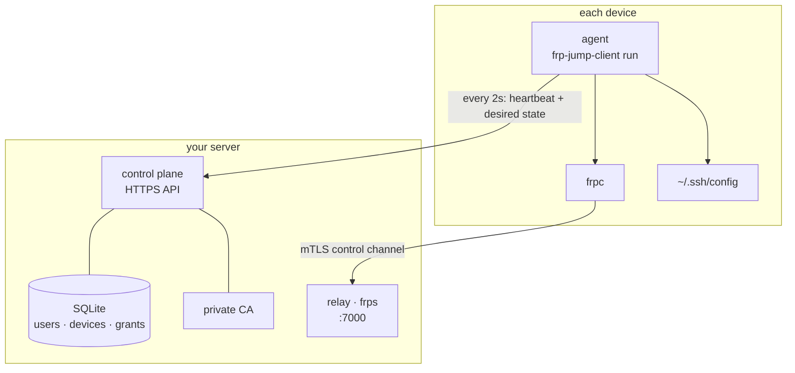
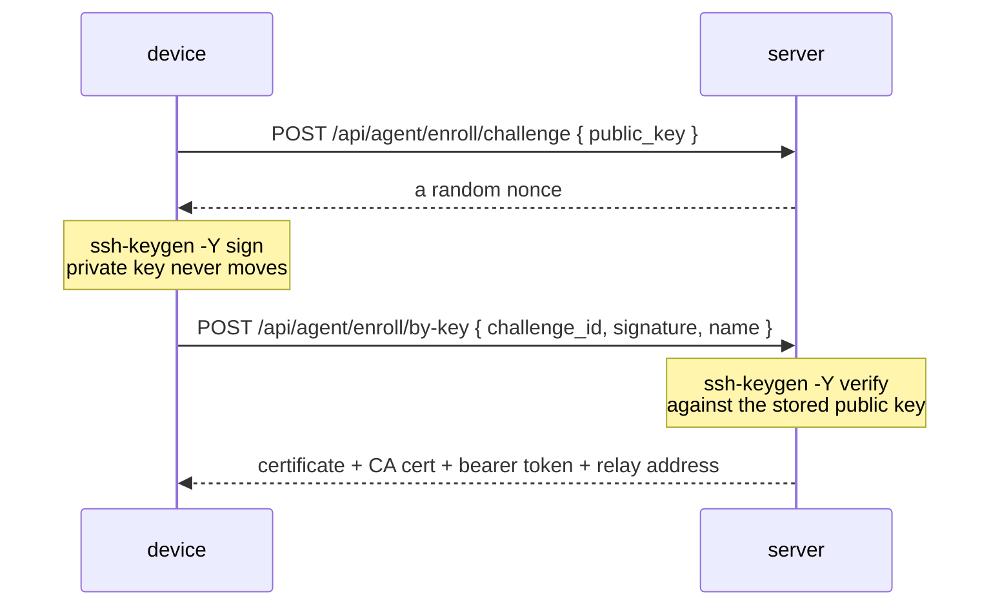
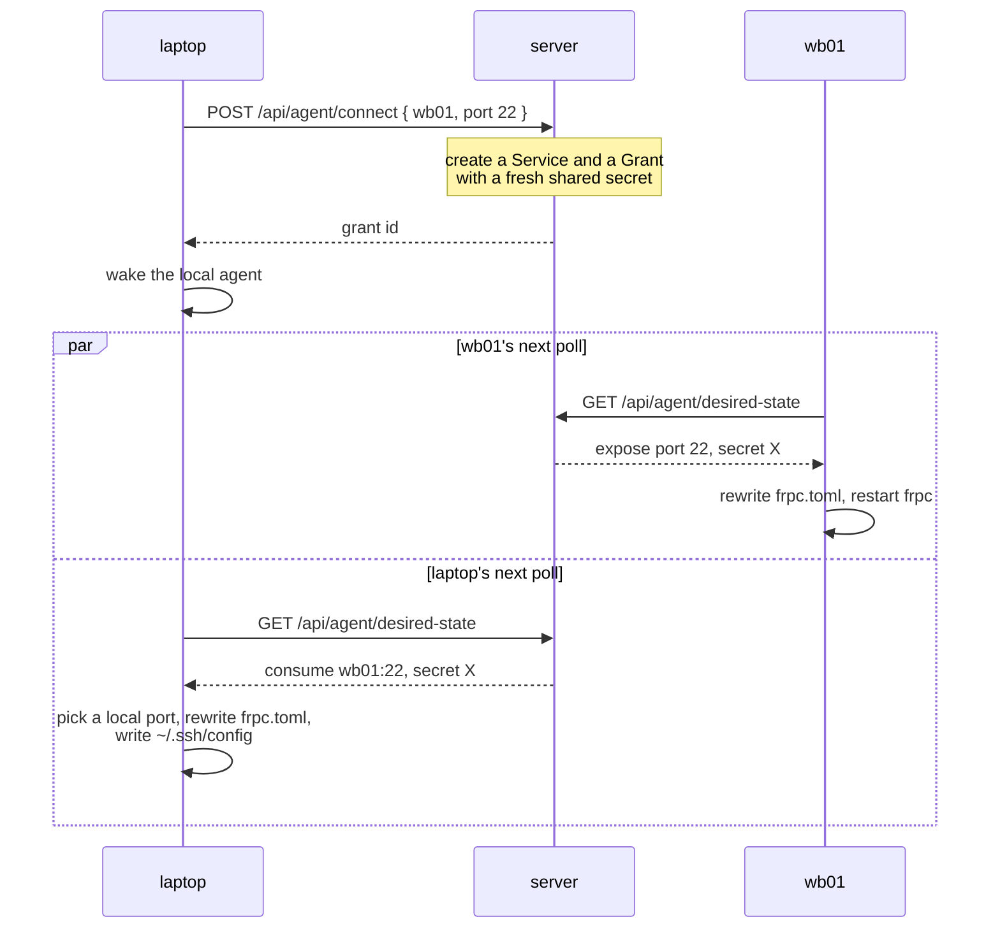
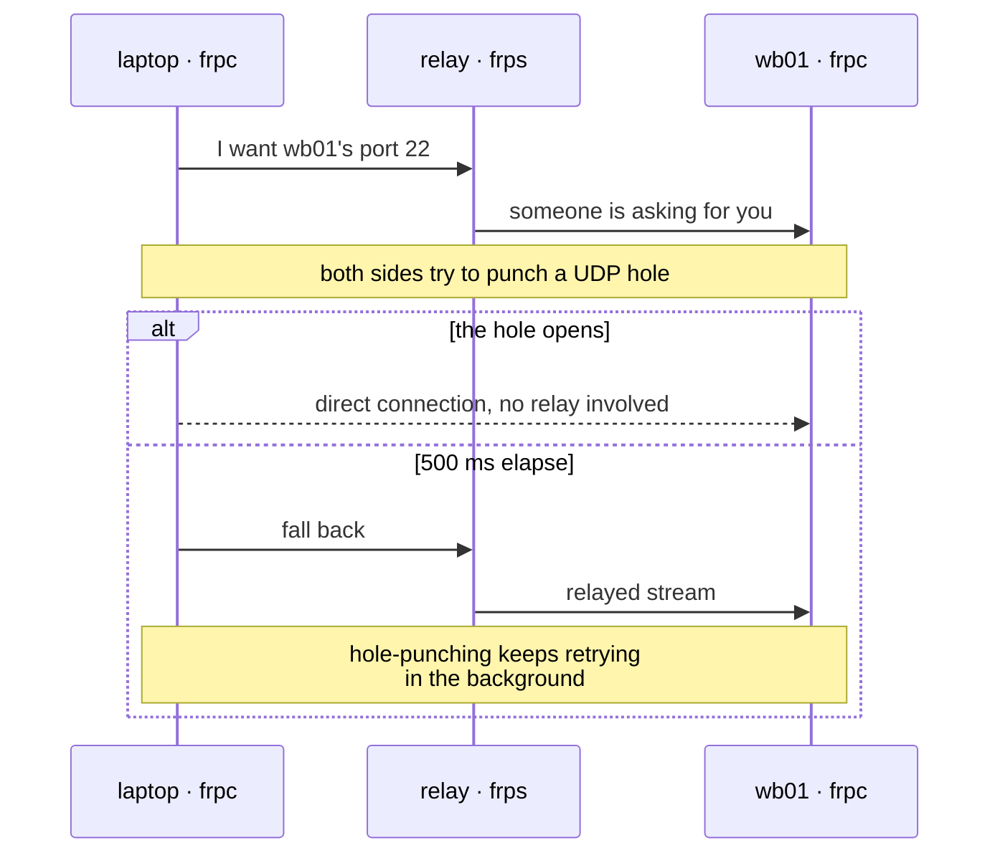
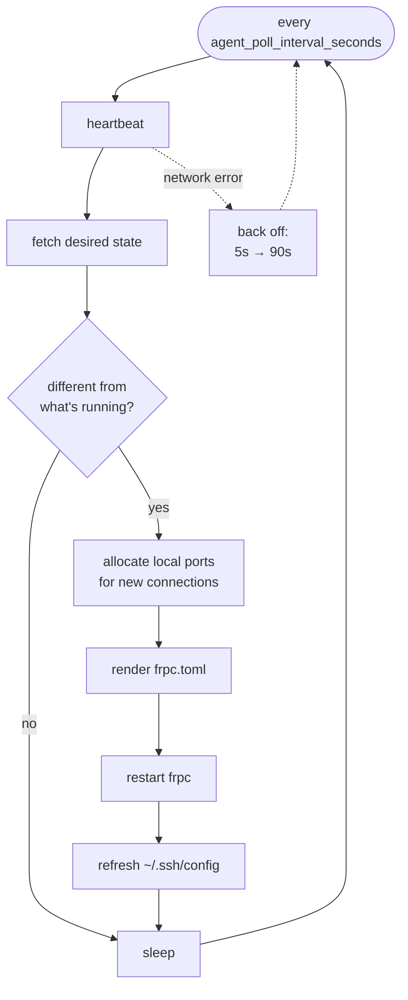
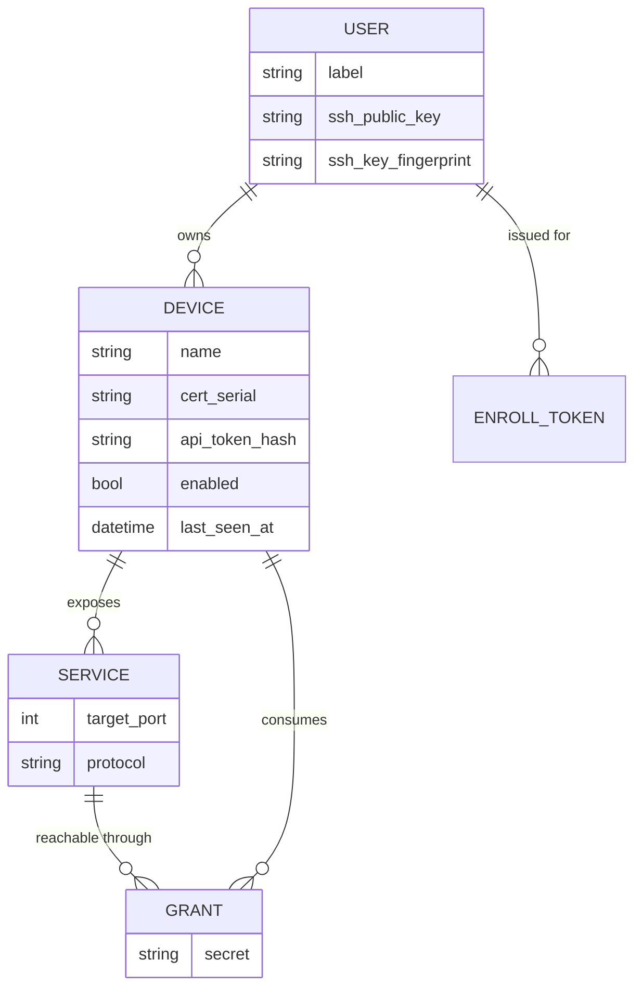

# How it works

frp-jump is a control plane on top of [frp](https://github.com/fatedier/frp).
frp already knows how to punch NAT holes and relay TCP. What it leaves to you is
everything around that: who exists, who may reach whom, what certificate each
machine gets, and which local port a tunnel lands on. That is what frp-jump
does.

## The three pieces



**The control plane** is an HTTPS API with a SQLite database behind it. It is
metadata only. No tunneled byte ever passes through it. It also runs a private
certificate authority that issues one client certificate per device at
enrollment.

**The relay** is a stock frps process, configured by the same code that
configures frpc. It only accepts connections presenting a certificate from that
CA.

**The agent** runs on every device. It asks the control plane what this device
should be doing, rewrites frpc's config to match, restarts frpc when the config
changed, and keeps the managed part of `~/.ssh/config` in sync.

Administration is `frp-jump-server` commands over SSH to the box. There is no
web interface of any kind — SSH access to the server *is* the admin boundary,
the same as it is for anything else you run there.

## Enrolling a device

Two ways in. Both end with the same thing: a client certificate, a bearer token,
and a device row in the database.

### With your SSH key

This is the normal path, once an admin has registered your public key.



The signature is namespaced (`-n frp-jump-enroll`), so it can never be replayed
as, say, a signature on a git commit. Verification shells out to real OpenSSH —
no library reimplements this.

The challenge endpoint always returns a nonce, whether or not it recognises the
fingerprint. An unknown key fails at the next step, exactly like a bad
signature. A 404 here would tell an anonymous caller which keys the server
knows.

### With a one-time token

For a device you would rather not hand a personal key to, or a person who has no
key registered yet.

```sh
frp-jump-client devices add-token --name wb01   # self-service, from your own device
frp-jump-server enroll-tokens create --user me  # or minted by an admin
```

The token is shown once, expires in 24 hours, and redeems exactly once.
Redemption is an atomic conditional update, so two machines racing on the same
token cannot both win.

## Making a connection



The side that ran `connect` wakes its own agent immediately instead of waiting
out the poll interval. The other side finds out on its next poll — two seconds
by default.

Notice what the server does *not* do: it never tells a device which local port
to bind. It has no idea what is free over there. The consuming agent picks one
from its own range and remembers it, so the port stays stable across restarts
and your ssh aliases don't shift under you.

## Peer-to-peer, with a relay to fall back on

This is frp's own mechanism, wired up by frp-jump. For each connection, the
exposing device gets two frpc proxies sharing one secret — one `xtcp` (direct)
and one `stcp` (relayed). The consuming device gets two matching visitors, with
the direct one pointed at the relayed one as its fallback.



Whichever path wins, your ssh client sees the same local port. That is the whole
point: you never have to know.

In frpc's config the pair looks like this, on the exposing side:

```toml
[[proxies]]
name = "<grant-id>-xtcp"
type = "xtcp"
secretKey = "<shared secret>"
localPort = 22
transport.useEncryption = true

[[proxies]]
name = "<grant-id>-stcp"
type = "stcp"
secretKey = "<shared secret>"
localPort = 22
transport.useEncryption = true
```

and on the consuming side:

```toml
[[visitors]]
name = "<grant-id>-stcp-visitor"
type = "stcp"
serverName = "<grant-id>-stcp"
bindPort = -1                          # takes fallback traffic only

[[visitors]]
name = "<grant-id>-xtcp-visitor"
type = "xtcp"
serverName = "<grant-id>-xtcp"
bindAddr = "127.0.0.1"
bindPort = 40000                       # the port the agent picked
fallbackTo = "<grant-id>-stcp-visitor"
fallbackTimeoutMs = 500
```

`useEncryption` covers the tunneled payload, not just the control channel. The
per-connection secret is the real gate — frp's own `allowUsers` ACL is set to
`*` and is not doing the work here.

### When peer-to-peer can't work

Some networks never punch through: a symmetric NAT, or a VPN that captures every
packet. Left alone, each new connection spends the fallback timeout failing at
something that was never going to succeed.

```sh
frp-jump-client set-p2p disabled
```

That collapses the pair above into a single relayed visitor on this device. It
affects only what this device dials out to — other devices can still reach *it*
directly, because its exposing-side proxies are untouched. The setting lives in
that device's own state, not on the server.

## The agent loop



A failed cycle retries sooner than a healthy one, then backs off exponentially,
so an outage doesn't turn into a thundering herd when the server comes back.

`connect`, `disconnect`, and `set-p2p` drop a wake file that shortcuts the
sleep, so your own device applies changes almost immediately.

The ssh config the agent writes goes in its own managed file, pulled into your
real `~/.ssh/config` by a single `Include` line. Your own entries are never
touched.

## The data model



A few things worth knowing about this shape:

- **A person is an SSH public key.** No email, no password, no account record
  beyond a friendly label.
- **Device names are unique per owner, not globally.** Two people can each have
  a `laptop`. That is why admin commands that change a device require `--user`.
- **Services are synthetic.** `connect` creates them on demand from just
  (device, port). Nobody names them and nobody sees them.
- **A grant is one direction.** Laptop-to-wb01 and wb01-to-laptop are two
  separate grants with separate secrets.
- **Local ports are not in here.** They live in each agent's own state file,
  because only the device knows what is free.

Profiles — the names you pass to `--as` — are also purely local. The server
knows the connection as (device, port), nothing more.

## What this doesn't do

Two honest limits, both inherited from frp rather than chosen here.

**Traffic figures only count relayed bytes.** `frp-jump-server users show`
reports "relayed today: X in / Y out" from the relay's own counters. A
connection that is genuinely peer-to-peer never touches the relay, so it reports
zero even while moving gigabytes. frp does not account for direct traffic
anywhere, on either side.

**There is no "is this connection direct right now?" indicator.** frpc's admin
API reports proxy status on the exposing side, and has no equivalent for
visitors. Rather than guess, `status` reports what it knows and leaves it at
that.

## See also

- [Security model](security.md) — the trust boundaries and what revocation
  actually does.
- [Internals](architecture.md) — decisions, constraints, and the things that
  already surprised someone once.
