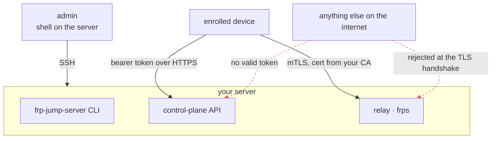

# Security model

This page says what frp-jump protects, how, and where the edges are. It is
deliberately specific about the limits — a tunneling tool that oversells itself
is worse than one that doesn't.

## Trust boundaries



Three separate mechanisms, each doing one job:

| Boundary | Mechanism | Protects |
| --- | --- | --- |
| Admin to server | SSH to the box | Everything. There is no other admin path |
| Device to relay | mTLS with your own CA | The channel that actually carries traffic |
| Device to control plane | A per-device bearer token over HTTPS | Metadata: enroll, heartbeat, "what should I do" |
| Device to device | A per-connection shared secret | One pair's tunnel, in frp itself |

The strongest mechanism guards the traffic-carrying channel. The control plane
moves only metadata, and its compromise does not by itself let anyone read a
tunnel.

## Identity

A person is an SSH public key. There is no email, no password, no reset flow.

An admin registers a key once:

```sh
frp-jump-server users add-key alice.pub --label alice
```

From then on Alice enrolls devices herself, by signing a server-issued challenge
with her private key. Both signing and verification shell out to OpenSSH — the
same mechanism git uses for signed commits. The signature is namespaced to
`frp-jump-enroll`, so it cannot be replayed in another context, and the private
key never leaves the device that holds it.

**There is no web interface.** Administration is CLI commands over SSH to the
server. Whoever can `sudo` on that box is an admin, which is the same boundary
you already have for everything else running there.

## What a device gets at enrollment

- A client certificate from your server's private CA, valid for client
  authentication only. It cannot be used to impersonate the relay.
- A bearer token for the control-plane API, stored hashed on the server.
- The relay's address.

All of it lands in a single JSON file in the device's data directory, along with
the private key. Treat that file as the device's credentials — anyone who can
read it is that device.

## Encryption

Two layers, and they are not the same thing:

- The frpc-to-frps control channel is mTLS.
- The tunneled payload itself is encrypted by frp (`transport.useEncryption`),
  for both the direct and the relayed path.

So the relay operator — you — cannot read the contents of a relayed connection
just by watching frps.

And of course SSH over the tunnel is still SSH. The tunnel is not what is
protecting your shell session.

## Authorization

Every self-service endpoint is scoped to the calling device's owner. Ask about a
device you don't own and you get "not found", not "forbidden" — the answer is
the same whether the name belongs to a stranger or to nobody. Since names are
unique per owner rather than globally, your own devices are the only namespace
you can observe at all.

## Turning a device off

This is the part worth reading carefully, because "disabled" means something
specific here.

```sh
frp-jump-client devices disable old-laptop       # your own
frp-jump-server devices disable wb01 --user me   # anyone's
```

**What it does, on that device's next poll:**

- Its desired state goes empty, both what it exposes and what it consumes. Its
  agent tears down every tunnel.
- Every *mutating* API route starts rejecting its token. It cannot re-enable
  itself, rotate the owner's key, delete another device, or open a connection.

**What it deliberately does not do:**

- It does not stop the device authenticating to the control plane. A disabled
  device keeps polling, which is how it notices being re-enabled later.
- It does not touch frps or the certificate. A device whose frpc is already
  connected keeps that connection, and whatever it was last configured to relay,
  until it reconnects or the relay restarts.

So `disable` is a *reversible* control-plane action with a delay bounded by the
poll interval. It is not instant revocation.

**Cutting a device off immediately** — a machine you believe is compromised
right now — means rotating the CA, which re-enrolls everything. `delete` frees
the name and removes the rows, but does not reach into a live frpc connection
either.

## Rotating your key

```sh
frp-jump-client set-key ~/.ssh/id_ed25519_new ~/.ssh/id_ed25519
```

The rotation needs a challenge signed by **both** keys: the new one, to prove
you hold it, and the current one, to prove you are the account's owner. A bearer
token stolen from one device is therefore not enough to take over the account.

Lost the current key outright? That is the admin recovery path:

```sh
frp-jump-server users set-key alice new.pub
```

## Deployment rules the software enforces

- `frp-jump-server run` refuses to serve the control-plane API in cleartext on
  an address reachable from outside the machine. Certificates and bearer tokens
  cross that wire on every call. Override with `allow_insecure_bind` only when
  TLS is genuinely terminated somewhere this process cannot see.
- The API serves a blank placeholder at `/` and disables FastAPI's automatic
  `/docs`, `/redoc`, and `/openapi.json`. A relay box is reachable from the
  whole internet by construction; there is no reason to hand a scanner a
  readable schema.
- The server's data directory is `0700`. The wrapper at
  `/usr/local/bin/frp-jump-server` runs admin commands as the service account,
  so you get that isolation without having to think about it.
- The generated server unit runs unprivileged with `ProtectSystem=strict`,
  `NoNewPrivileges=yes`, and exactly one writable directory.

## Known weak spots

Stated plainly, because you should know them before deploying this.

**The frp binary's checksum comes from the same place as the binary.** On first
run, an agent downloads the pinned frp release from GitHub and verifies it
against the checksum file published alongside it. That catches a corrupt or
truncated download. It does not catch a compromised connection or a compromised
upstream release, because whoever can tamper with one response can tamper with
both. Pinning per-architecture digests in configuration would fix this and is
not done today.

**Nothing is rate-limited.** An enrolled device can mint enroll tokens and
create connections without a cap. Given that it is spending rows in its own
owner's database, on your own server, this is accepted rather than defended
against.

**Peer-to-peer connections are invisible to the server.** That is the point of
peer-to-peer, but it does mean traffic figures and any notion of "what is this
device doing right now" only cover the relayed path.

**Real NAT traversal is not covered by the test suite.** The integration test
runs over loopback. It proves the configuration shape and the fallback
mechanism, not that hole-punching works across two real networks.

## Reporting a problem

There is no dedicated security contact for a project this size. Open an issue,
or reach the maintainer directly if you would rather not post it publicly.

## See also

- [How it works](how-it-works.md) — the mechanics behind these boundaries.
- [Configuration](configuration.md#why-the-server-refuses-to-start-sometimes) —
  the TLS rules in practice.
